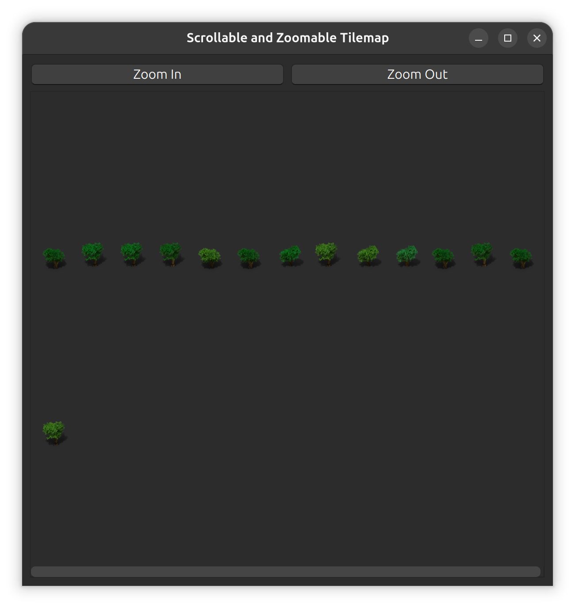

# Anki Forest



An [Anki](https://apps.ankiweb.net/) add-on that turns a deck into a forest. Each card you've studied becomes a tree, and each card that's due for review becomes a tree stump. The longer a card's review interval, the bigger its tree.

> **Status:** early prototype. The core loop works, but the visuals are still rough (see [Known limitations](#known-limitations)).

## How it works

1. The add-on adds a **Generate Forest** button to the top of Anki's **Stats** window.
2. Clicking it collects every card in the currently selected deck and records, for each one:
   - whether it has been studied (`card.reps > 0`)
   - whether it's due for review (`queue == 2` and `due <= today`)
   - its current interval (`card.ivl`, in days)
3. A separate window opens with the cards laid out in a roughly square grid:
   - **Not studied yet:** empty cell
   - **Due for review:** a random stump image
   - **Not due:** a random tree image, sized by interval
4. **Zoom In** / **Zoom Out** buttons scale the tiles, and the grid scrolls.

## Project layout

```
__init__.py   Add-on entry point: stats-dialog hook, forest window (TilemapWindow)
tests.py      Scratch/debug script (adds a "test" item to Tools that prints due cards)
assets/       Tree and stump PNGs (384×768 RGBA)
```

Asset filenames follow the pattern `<type>_<size>_<n>.png`:

- `type` is `tree` or `stump`.
- `size` is a size class, not a pixel size:
  - trees: 300, 350, 400, 450, 500
  - stumps: 200, 250, 300, 350, 400
- `n` is a variant index. One variant per class is picked at random.

Each card's interval is matched to the closest threshold (1, 3, 8, 15 or 30 days), which picks its size class:

| Interval threshold (days) | 1 | 3 | 8 | 15 | 30 |
|---|---|---|---|---|---|
| Tree | 300 | 350 | 400 | 450 | 500 |
| Stump | 200 | 250 | 300 | 350 | 400 |

## Installation (development)

Anki loads add-ons from its `addons21` folder. Symlink (or copy) this repository into it:

```bash
# Linux
ln -s "$(pwd)" ~/.local/share/Anki2/addons21/anki_forest

# macOS
ln -s "$(pwd)" ~/Library/Application\ Support/Anki2/addons21/anki_forest

# Windows: %APPDATA%\Anki2\addons21\anki_forest
```

Symlink may cause trouble, in that case: copy-paste;

Restart Anki, choose a deck, open **Stats**, and click **Generate Forest**.

Requirements: Anki 2.1.x or newer (uses `aqt.gui_hooks.stats_dialog_will_show` and the Qt bindings Anki ships with). There are no extra Python dependencies.

Debug output goes through `print()`. To see it, start Anki from a terminal.

## Known limitations

- **Performance:** each card loads its own `QPixmap` at full size (384×768), and the assets folder is re-listed for every card. Large decks will be slow and use a lot of memory.
- **Zoom:** zooming resizes the labels but not the grid spacing.
- **Packaging:** there's no `manifest.json` or `config.json` yet, so the add-on can't be packaged as an `.ankiaddon`.
- *It's just not very satisfying yet*